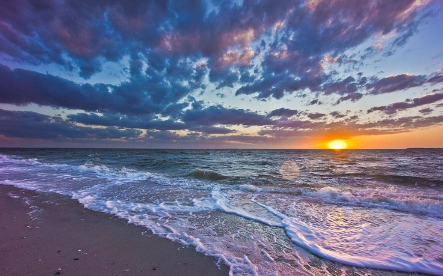

<!DOCTYPE html>
<html lang="en">
<head>
    <title> Project Of Nature</title>
    <meta charset="UTF-8">
    <meta name="viewport" content="width=device-width, initial-scale=1.0">
</head>
<body>
    <header>
        <h1>Welcome to My Webpage</h1>
        <nav>
            <ul>
                <li><a href="#section1">Section 1</a></li>
                <li><a href="#section2">Section 2</a></li>
                <li><a href="#section3">Section 3</a></li>
            </ul>
        </nav>
    </header>
    <main>
        <section id="section1">
            <h2>Section 1</h2>
            
This is the first section of my webpage.

            
        </section>
        <section id="section2">
            <h2>Section 2</h2>
            
This is the second section of my webpage.

            
        </section>
        <section id="section3">
            <h2>Section 3</h2>
            
This is the third section of my webpage.

            
            
        </section>
    </main>
    <footer>
        
&copy; 2024 My Webpage. All rights reserved.

        
For more information, visit <a href="https://theculturetrip.com/">example.com</a>

    </footer>
</body>
</html>
